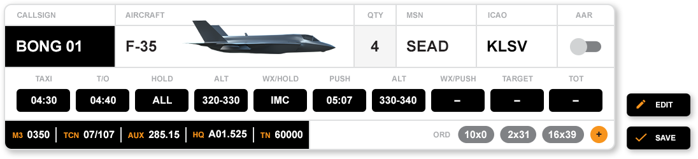
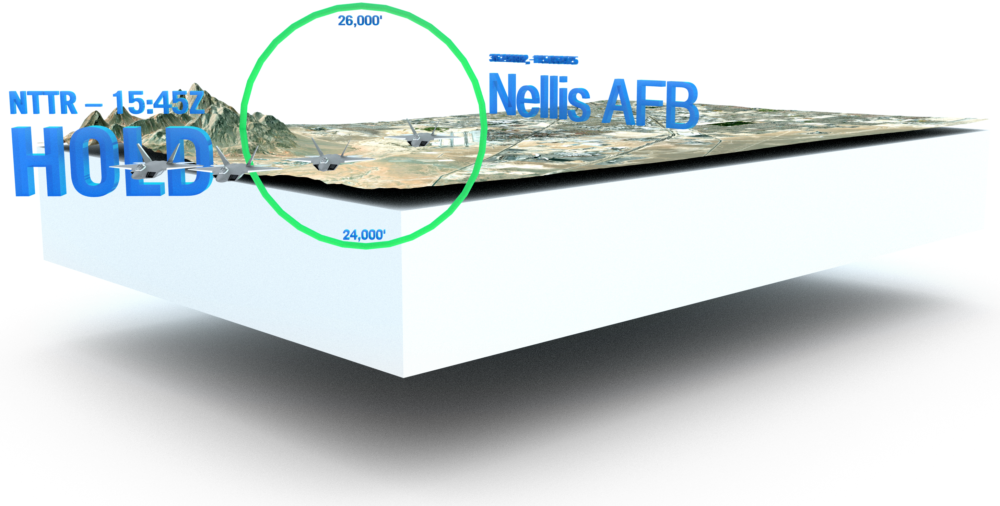
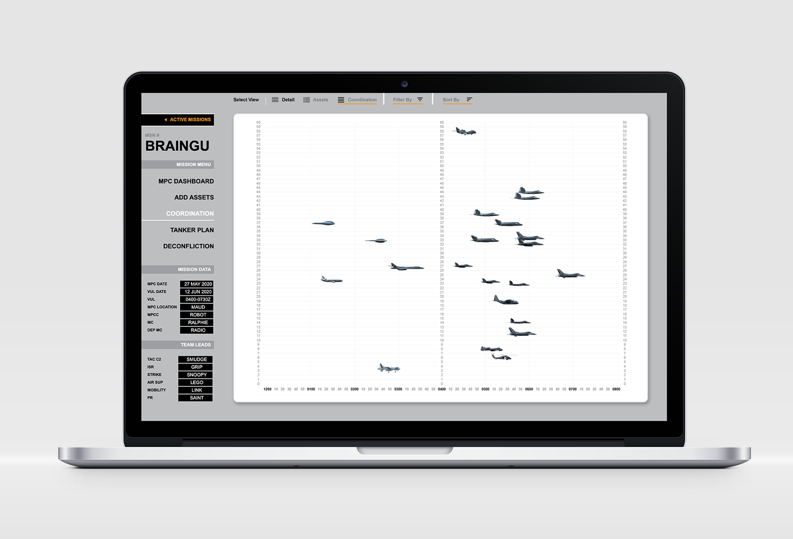

<section class="intro">
  

    
  

  

    
{{ page.sections.intro.banner.leftText }}

    
    

    
    
{{ page.sections.intro.banner.rightText }}

  

</section> <!-- End Intro -->
<section class="main">
  

    

      <h3>{{ page.sections.main[0].descriptor }}</h3>
      <h2>{{ page.sections.main[0].purpose }}</h2>
    

    

      <iframe width="560" height="315" src="{{ page.sections.main[0].video }}" frameborder="0" allow="accelerometer; autoplay; encrypted-media; gyroscope; picture-in-picture" allowfullscreen></iframe>
    

    

      

        

          
        

        

          
{{ page.sections.main[0].feature.compactDescription }}

          

          {{ page.sections.main[0].feature.expandedDescription }}
          

        

      

    
<!-- End Img-text block -->
    

      

        <h3>Enabling Warfighters to focus on</h3>
        <h2>Tactics &amp; Lethality</h2>
      

    
<!-- End Bar -->
    

      

        

          
Visualize Coordination Details Immediately

          

          
A mission planning cell chief (MPCC) is able to visualize coordinating details immediately as the mission takes shape, even when those planning cells are spread across the globe.

          

        

        

          
        

      

    
<!-- End Img-text block -->

  
 <!-- End Gradient Group -->

  

    

      

        
        
Automatically create mission products

        
Mission details such as CSAR, Timeline, Codewords, and COMM Plan are exported into a standard Coordination Card format. Dynamic tanker plan allows for primary and fall out plans to be directly inserted.

      

      

        
        
All domain operation capability

        
Assets from CYBER, SPACE, and more are invovled in the process and coordination

      

      

        
        
Coordinate from mulitple locations

        
WIDOW is designed against the AFTTP 3-3.IPE standard for mission planning with each unit working in unison.

      

    

    
  

  

    
    

      

        
Visualize Mission Data with Dynamic Mapping

        
Dynamic mapping visualizes the mission timeline, effects, assets, routes, and positions while automatically highlighting conflicting altitudes, times, and locations.

      

    

  
<!-- End icon-graphic-group -->
  

    

      <h3>Coming Up</h3>
      <h2>Planned exercises</h2>
    

    

      

        

          
        

        

          
Red Flag

          

            
Red Flag exercises provide mission commanders, and air, space, and cyber operators the opportunity to experience realistic combat scenarios to prepare for future warfare. The goal of Red Flag is to prioritize the experience of an operator's "first" combat mission, mission commander upgrades, and Flag unique experiences for all participants.

            

              

                
RF-ALASKA 20-3

                
30 JUL - 14 AUG

              

              

                
RF-ALASKA 21-1

                
08 OCT - 23 OCT

              

            

          

        

      

    

    

      

        

          
        

        

          
Orange Flag

          

            
Orange Flag is a multi-domain test event specializing in collaborative, large force test that spans domains, services, and platforms.  Orange Flag allows data-driven test and experimentation to occur in a complex, operationally representative environment.

            

              

                
OF 20-3

                
30 SEP - 01 OCT

              

            

          

        

      

    

    

      

        

          
        

        

          
Valiant Shield

          

            
Biennial field training exercise aimed at ensuring the joint force is ready to conduct a wide range of combat operations.

            

              

                
VS 20

                
14 SEP - 25 SEP

              

            

          

        

      

    

    

      

        

          
        

        

          
WSINT

          

            
U.S. Air Force Weapons School Integration (WSINT) is a series of complex, large-force employment missions that serve as the capstone portion of Weapons School classes, which take place twice a year. WSINT involves the planning and execution of every aspect of air, space and cyber combat operations, with joint force components converging over the Nevada Test and Training Range.

            
WSINT demonstrates the strategic advantage of multi-domain, integrated command and control and produces leaders capable of delivering success in a spectrum ranging from small tactical teams to strategic transformational change.

            

              

                
WSINT 20B

                
23 NOV - 16 DEC

              

            

          

        

      

    

  
<!-- End Excercises -->

  

    

      <h3>Timeline for release</h3>
      <h2>Capabilities Under Development</h2>
    

    

      

          1801 Flight Plan <strong>JUL 2020</strong>
      

      

          Dynamic Comm Plan <strong>AUG 2020</strong>
      

      

          Integrated Chat <strong>SEP 2020</strong>
      

      

          SIPR Deployment <strong>SEP 2020</strong>
      

      

          Dynamic Deconfliction by GEO/TIME <strong>TBD</strong>
      

      

          Integrated Map and Fly-Through <strong>TBD</strong>
      

      

          Infinite Whiteboard <strong>TBD</strong>
      

      

          GATT Flow &amp; MSN Timeline <strong>TBD</strong>
      

      

          Kessel Run Integration <strong>TBD</strong>
      

      

          Dynamic NKE Planning Tool <strong>TBD</strong>
      

      

          Top Secret Deployment <strong>TBD</strong>
      

      

          Ability to Reject Changes <strong>TBD</strong>
      

      

          Mission Debrief <strong>TBD</strong>
      

      

    

  
<!-- End Timeline -->

  

    

      

        <h3>Additional</h3>
        <h2>Documents</h2>
      

    

    

      <a href="docs/WIDOW - WSINT Press Release.pdf">WIDOW Press Release</a>
      <a href="docs/WIDOW - HBM - WIDOW for USAF.pdf">Designation of WIDOW as the USAF Mission Planning Cell Tool</a>
      <a href="docs/WIDOW - Leadership and Operator Quotes.pdf">Leadership and Operator Quotes</a>
      <a href="docs/WIDOW - Future Employment Diagram.pdf">Future Employment Diagram</a>
    

  

</section><!-- End Main -->
<section class="support">
  

    
Need Help? Have Questions?

    <a class="support-link" href="mailto:support@widow.app">support@widow.app</a>
  

  

    
  

</section>
